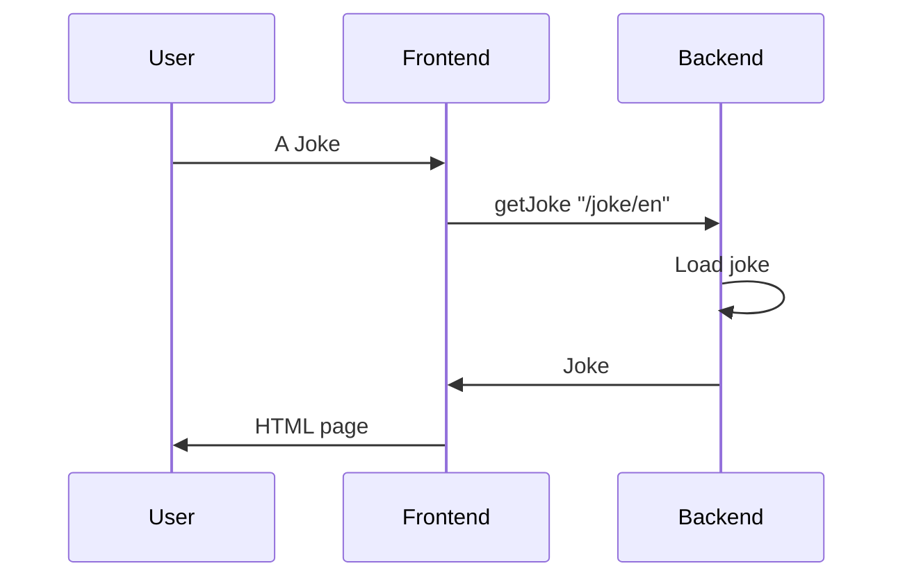

# Learn Istio by Example

The goal of this repository is to help us to learn istio by some examples.

## Services

We prepare two sample `services` : `Backend` and `Frontend`.



`Backend` service is repsonsible for providing english joke in `/joke/en` path. `Frontend` request `Backend` for joke and shows it as `HTML page` in `/joke` path.

## Inject Settings
To mimic some scenario like `failure` and `delay`, we add some features to both `Backend` and `Frontend`.

### Delay
We can set response `delay` in second for both `Backend` and `Frontend`. To enable delay, we should set the following environment variable:

```bash
# Set 10s for resposne delay
REPLY_DELAY=10
```

### Failure
We can mimic a service `failure` in each service. To enable this fake `failure`, we should set following environment variable:

```bash
INJECT_FAILURE=1
```
By enabling this feature, the service will return `HTTP Code 502`.
